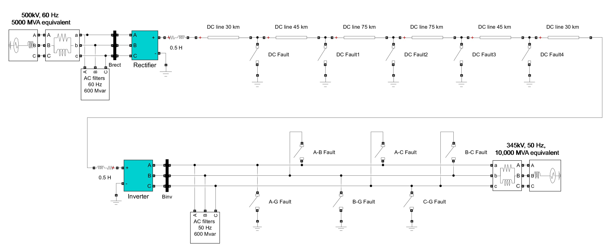

# Fault Detection in HVDC Systems using Machine Learning

## Project Description

This project focuses on developing a machine learning model for fault detection and diagnosis in High Voltage Direct Current (HVDC) transmission systems. The project uses simulated data generated from a MATLAB/Simulink model of a 300 km point-to-point HVDC system.

## Simulation Setup

A 300 km point-to-point HVDC system was modeled in MATLAB/Simulink. The system was simulated for 3.5 seconds with a 500 µs time step. Faults were triggered at 2.5 seconds with a random start-time variation to ensure steady-state conditions. Key signals, including AC voltages (Vabc, pu), AC currents (Iabc, pu), DC voltages (VdL, pu), and DC currents (Id, pu) at both the rectifier and inverter ends, were captured from 2.0 seconds to 3.5 seconds for detailed fault analysis.

## Dataset Generation

The dataset was generated by simulating 12 distinct system conditions:

*   **Normal Operation:** No fault ('None')
*   **DC Line Faults:** At 10%, 25%, 50%, 75%, and 90% of the transmission line ('DC10'–'DC90')
*   **AC Side Faults:**
    *   Single-phase-to-ground faults: 'AG', 'BG', 'CG'
    *   Phase-to-phase faults: 'AB', 'BC', 'AC'

To introduce further variability, the following parameters were randomized across simulations:

*   **Fault Duration:** 0.01 s, 0.05 s, 0.1 s, 0.2 s, 0.3 s, 0.5s
*   **Fault Resistance:** 0.01 Ω, 0.1 Ω, 1 Ω, 10 Ω, 50 Ω, 100 Ω, 500Ω
*   **Fault Start Time:** A random offset between 0 and 0.5 seconds added to the fault trigger time

Each scenario was repeated between 40 to 60 times, resulting in a final dataset containing 22,612 samples.

## Dataset Link

The generated dataset is available on Hugging Face Datasets:

[HVDC-SIMULATED-FAULTS-FINAL](https://huggingface.co/datasets/tahabou/HVDC-SIMULATED-FAULTS-FINAL)

## Simulink Model Image

## Code Description

*   **parallelSimulationRunner.m:** This MATLAB script automates the HVDC fault simulations in parallel. It loads the Simulink model (`HVDCThyristorBased.slx`), generates fault scenarios using `scenarioGenerator()`, sets simulation parameters, runs the simulations in parallel using `parsim`, and saves the results as both .mat files and CSV files.
*   **simulationRunner.m:** This script was intended to run the HVDC fault simulations in single execution.
*   **HVDCThyristorBased.slx:** This is the Simulink model of the 300 km point-to-point HVDC system.
*   **scenarioGenerator.m:** This MATLAB function generates the fault scenarios used in the simulations. It defines the fault types, fault times, fault durations, and fault resistances, and creates a cell array of scenario structs.
*   **hvdc_fault_detection_model_training.ipynb:** This is a Jupyter Notebook that contains the machine learning code for fault detection and diagnosis.
*   **xFinalState.mat:** This file contains the final state of the Simulink model from a previous simulation, which is used as the initial state for subsequent simulations.
